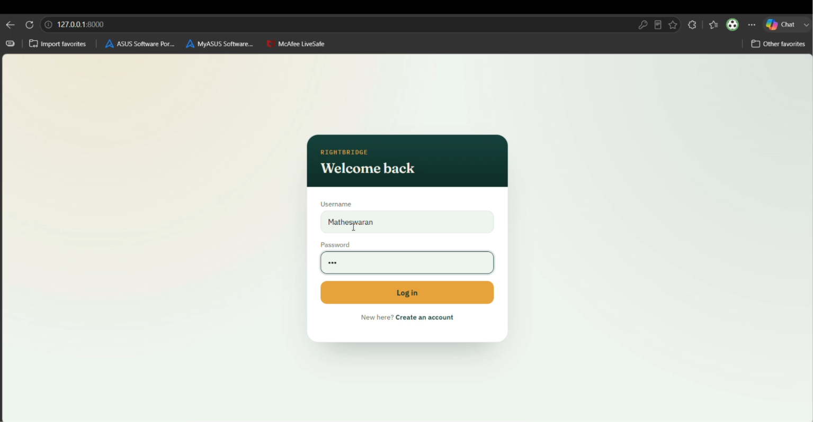
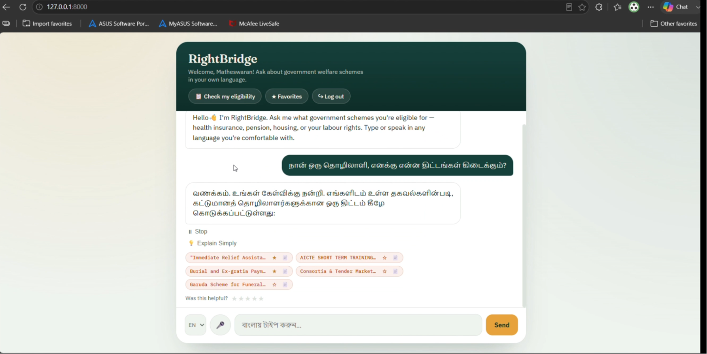
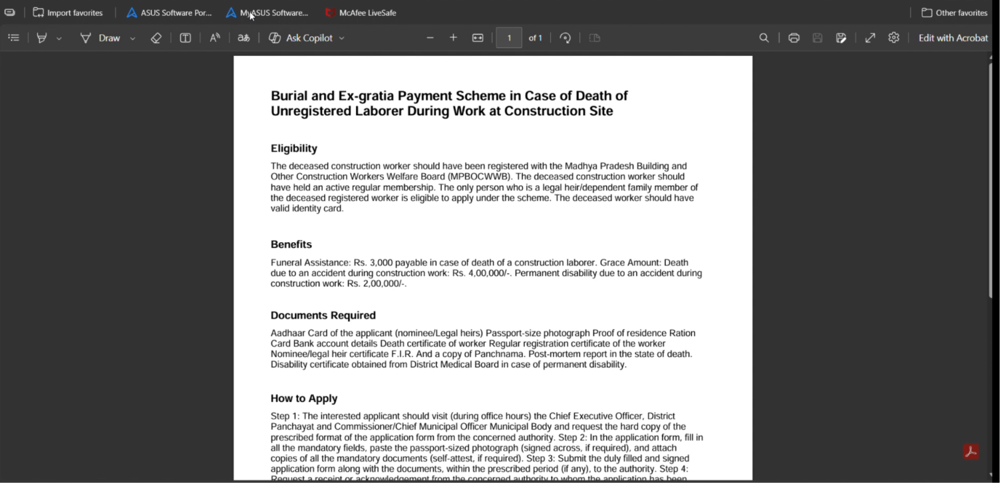
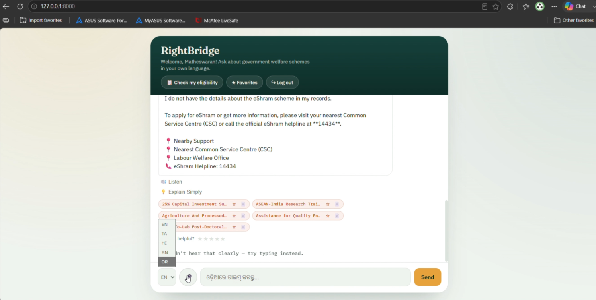
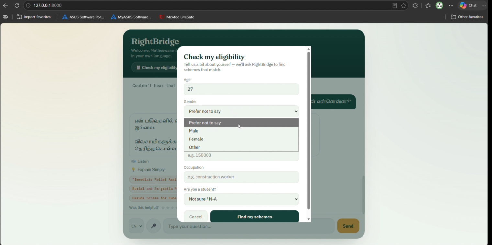

# RightBridge

### AI-Powered Government Scheme Assistant for Migrant Workers

RightBridge is an AI-powered multilingual chatbot designed to help migrant workers easily discover government welfare schemes, understand eligibility, access required documents, locate nearby support centers, and receive emergency labour assistance through a simple conversational interface.

Developed for the **Build in AI for India Hackathon**.

---

## Problem Statement

Millions of migrant workers struggle to access government welfare schemes because of:

- Lack of awareness about available schemes
- Language barriers
- Complex application procedures
- Difficulty understanding eligibility
- Limited access to official guidance and nearby support centers

RightBridge simplifies this process using Artificial Intelligence.

---

## Key Features

- AI-powered Government Scheme Chatbot
- Multilingual Support
- Government Scheme Information
- Required Documents Assistant
- Nearby Help Centers
- Explain Simply (Easy-to-understand responses)
- Emergency Labour Helpline Support

---

## Technology Stack

| Category | Technology |
|----------|------------|
| Frontend | HTML, CSS, JavaScript |
| Backend | Python, FastAPI |
| Database | SQLite |
| AI Model | Google Gemini API |
| Version Control | Git & GitHub |
| Development Tool | Visual Studio Code |

---

## Project Workflow

```text
User
   │
   ▼
RightBridge Chatbot
   │
   ▼
Gemini AI
   │
   ▼
Government Scheme Database
   │
   ▼
Personalized Response
```

---

## Project Structure

```text
RightBridge_Ai/
│
├── app.py
├── ai.py
├── data.py
├── index.html
├── requirements.txt
├── rightbridge.db
├── updated_data.csv
├── README.md
├── .gitignore
│
├── images/
│   ├── home.png
│   ├── chatbot.png
│   ├── documents.png
│   ├── nearby_help.png
│   └── emergency.png
```

---

## Installation

Clone the repository

```bash
git clone https://github.com/Matheswaran2903/RightBridge_Ai.git
```

Navigate to the project

```bash
cd RightBridge_Ai
```

Create a virtual environment

```bash
python -m venv venv
```

Activate the virtual environment

**Windows**

```bash
venv\Scripts\activate
```

Install dependencies

```bash
pip install -r requirements.txt
```

Run the application

```bash
python app.py
```

---

## Demo Video

Watch the complete project demonstration here:

**Google Drive Link**

```
https://drive.google.com/file/d/1UJsPUbjD6QKTm2zITqIEm_EOUx2JzDRS/view?usp=sharing
```

---

## Screenshots

### Home Page



---

### AI Chatbot



---

### Required Documents



---

### Nearby Help Centers



---

### Emergency Labour Support



---

## Future Enhancements

- Voice Assistant
- OCR-based Document Verification
- AI Eligibility Checker
- WhatsApp Integration
- Mobile Application
- Cloud Deployment
- Real-time Government Scheme Updates

---

## Team

**Team Name:** GenCoders

### Team Members

- Matheswaran G
- LingeshPandian L

---

## Hackathon

**Build in AI for India Hackathon**

---

## License

This project is developed for educational and hackathon purposes.

---

## Contact

For any queries or collaboration regarding this project:

**Team GenCoders**

GitHub Repository:
https://github.com/Matheswaran2903/RightBridge_Ai